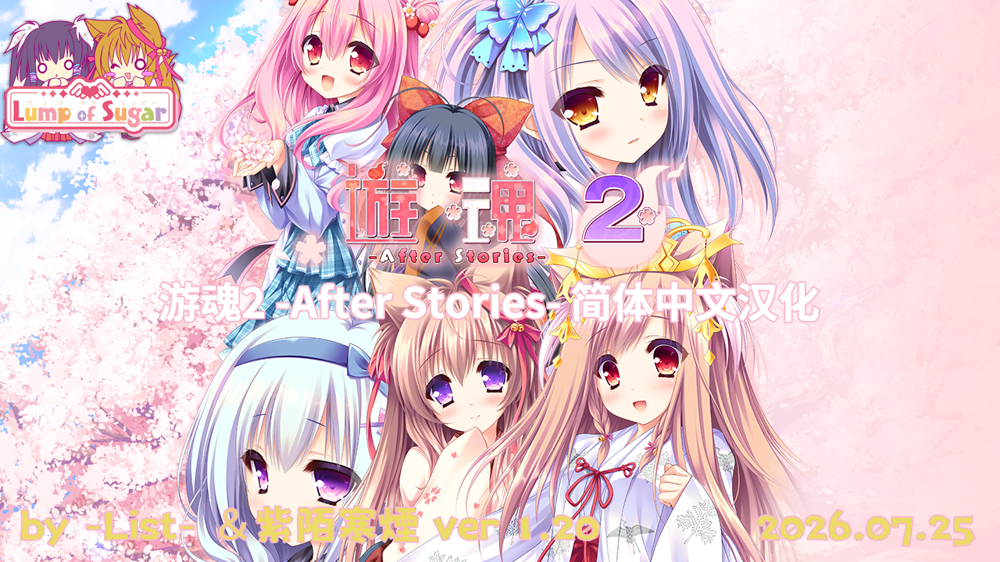
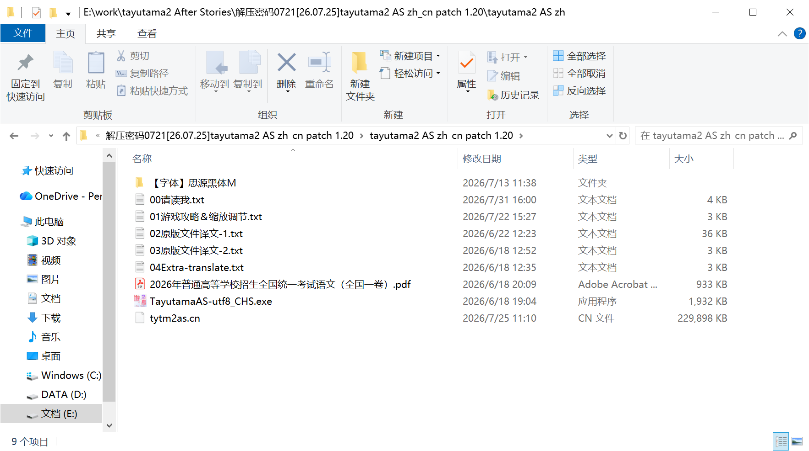
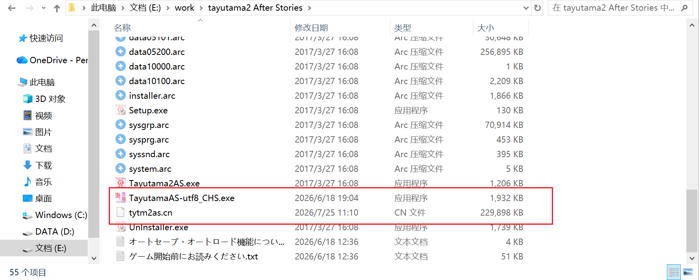
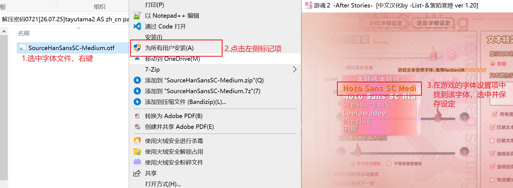
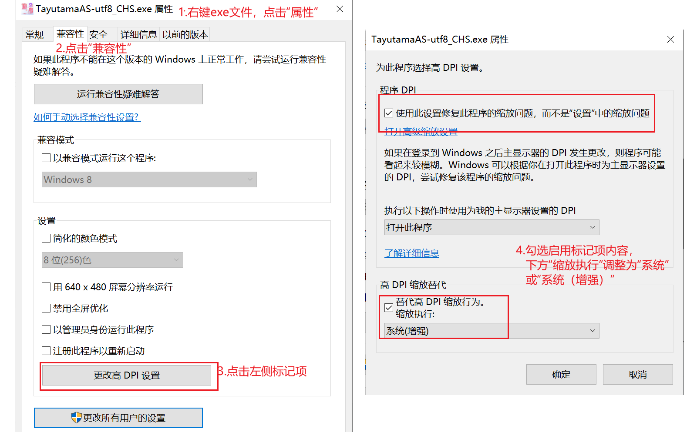

# 《游魂2 -After Stories-》简体中文汉化补丁

本页有关内容借鉴和使用了下面的项目：[夏梦方糖社同好会——游魂2 FD - After Stories -  开源汉化补丁](https://github.com/k25c2yf/BGI_utf8_for-Tayutama2AS)

本补丁部分内容的第一作者归属夏梦方糖社同好会，本页部分内容也根据其要求进行添加。

Lump of sugar 是 方糖社 (https://lumpofsugar.co.jp) 的商标。

素材来源于lumpofsugar.co.jp，版权归属方糖社所有。 出于汉化目的所做修改的文件版权归属于补丁制作者。

本补丁和原文件（不含相关工具）免费开源，所有内容须遵守开源协议（详见后文）。请务必从可信任的渠道获取本文章内容，否则因个人疏忽造成的损失由您自行承担。

注意：介于原游戏年龄限制，如果您未满18周岁，请不要访问和下载本页所有内容！！！

其他的相关链接：[BiliBili:【汉化】游魂2 -After Stories-](https://www.bilibili.com/video/BV1dEjA6yEvH)    [touchgal](https://www.touchgal.ink/c6c523e6)    [VNDB](https://vndb.org/v20340)

如有bug请及时反馈，在此感谢。

## 声明

简中汉化补丁系列，由-List-和紫陌寒煙合作完成。

本补丁仅适用于《游魂2 -After Stories-》日文原版，安装本补丁后可实现中文本地化的效果。

制作时，文本部分我使用DeepSeek在线推理翻译作为基础翻译，**非R18场景部分采用人工精校2轮，修正错误内容**（请见 1.20及更高版本）。
系统UI的多数文件我借用了“夏梦方糖社同好会”开源的PSD工程文件二次修改导出，缺少的部分和游戏CG均由我们两人手动修改，这里也借鉴使用AI去除原图中的部分元素。

任何人均可在个人研究/学习交流的用途下免费获取本补丁和原文件，禁止任何形式的付费交易，我们不会售卖本补丁，也不会对此为任何人承担来自盗卖者嫁接的退款责任。

如果您通过任何付费渠道获取到本补丁或看到有任何人售卖本补丁和原文件，请立即差评退款且在您力所能及的范围内进行维权。

本补丁仅用于个人学习交流，请于下载后24小时内删除。补丁制作不易，请尊重我们的劳动成果。


请点击**Releases**查看和下载正式补丁、额外分享文件。下载时，我们默认您已接受上述许可协议。

## 游戏介绍

鷹千帆市 矢古民（やこたみ）町在全国来说是一个能够聚集特别优质的神气的地方。

在这个城市中生活的人们为了“人和太转依能够共存”这一目标，日益努力着。


正因小镇中不止生活着人们，还生活着太转依们，所以在他们之间有着一场感谢祭。

举办的契机也是因为人和太转依之间的交流所引起的。

有一名太转依怀抱着感谢的心情为最爱的人用神通力做出了一个礼物。

而收到馈赠的人类也会奉献自己的神气，将自己的神气分享给太转依。

这自然而然所产生的习惯，在矢古民町的人和太转依之间广为流传、最终成为了被称为『人太祭』的祭奠。


但是、谁也没有想到这个祭奠会给矢古民町带来新的风暴。


**「啊!? 我的胖次不见了！」**

【文本来源于touchgal】

## License

采用 The GNU Affero General Public License. AGPL v3 协议进行许可。

你可以在[这里](LICENSE)找到这份协议的副本。

简单来说，您需要遵守以下要求，其中可能有部分是作为我们的附加条款而存在的，并不是AGPL3中原始存在的内容，但您仍需遵守。

对于派生的分支和相关基于本仓库的项目，在保留相同许可证的同时也需遵守和保留我们的附加条款。

以及，您如果需要在新的分支进行修改和二次开发，以及转载发布，您必须保留来源地址（即本仓库的url地址）和所有贡献者的署名。

```
1.不允许他人修改后闭源：
GNU AGPL 要求任何基于该软件的修改和派生作品都必须以相同的许可证发布，并且源代码必须公开。

2.其他分支也需要采用同样的许可证：
根据 GNU AGPL 的要求，任何以该软件为基础的分支或派生作品都必须遵循相同的许可证。

3.保留上游分支的参与者署名：
GNU AGPL 要求在派生作品中保留原始软件的版权声明和作者信息。

4.保留上游分支的来源信息：
GNU AGPL 要求在派生作品中保留原始软件的许可证和源代码信息。

5.分支名称不能重复：
虽然 GNU AGPL 没有直接规定分支名称不能重复，但它要求派生作品必须以相同的许可证发布，并且源代码必须公开。
因此，派生的分支名称的选择可能需要遵循通用的开源软件命名规范，以避免混淆和冲突。
```

此外，本仓库的所有内容请勿用于任何其他用途，仅允许个人测试、学习和交流使用，禁止一切转载与二次分发


## 补丁安装

下载链接1：[GitHub](https://github.com/Chisaki-pd/Tayutama2-After-Stories-_Simplified-Chinese-patch/releases/tag/v1.20)选择下载汉化补丁包（约219MB），解压密码：0721。

下载链接2：[百度网盘](https://pan.baidu.com/s/1VtRyUHCWLnz5zWEqOTBNWw?pwd=0721)，提取码＆解压密码：0721。

下载链接3：[OneDrive](https://1drv.ms/f/c/cb59d20e711a9873/IgCydP-UQQIoSqDT5VJsIkS7Ad-6UNEIKNnVeTeeitWViXE?e=x1mOHH)，解压密码：0721。

下载文件后，解压文件。你会得到以下文件。



我们需要把TayutamaAS-utf8_CHS.exe，tytm2as.cn文件复制到游戏根目录下，双击运行TayutamaAS-utf8_CHS.exe。



压缩包内附带字体文件“思源黑体M”，推荐安装使用该字体。



**主程序TayutamaAS-utf8_CHS.exe借鉴使用了夏梦方糖社同好会的开源项目，在此表示感谢。**

## 关于程序缩放设置

由于原游戏原生分辨率仅有720P，且BGI引擎默认会屏蔽缩放策略，导致在高分辨率显示器上即使开启缩放实际窗口模式显示依旧太小。

请根据下图操作，使用系统缩放策略。

**注意，这可能会导致画面略有模糊。**



## 历史汉化版本详情

ver1.20 汉化：2026.07.25
修正：重校对、润色及修正游戏剧本。修复章节『绯文接受的理由』部分闪退问题。修正设定项目中的文本错误。
汉化：增添部分CG的内容汉化。


ver1.10 汉化：2026.06.21
修正：修正部分转场CG显示错位问题，修正部分文本内容，修正『story（故事）』部分CG文本翻译错误问题。


ver 1.00 汉化：2026.06.18
汉化：系统UI，CG，图标，OP动画嵌字。


**额外分享文件包含汉化修改的CG图片（png格式）、主题曲、插入曲。CG图片仅用于个人使用，不得商用！！！**

## Staff

CG修改＆嵌字：-List-＆紫陌寒煙

程序＆脚本修改＆封包：-List-  (https://space.bilibili.com/700095337)

文本：DeepSeek推理翻译+人工校对

测试：-List-＆紫陌寒煙

OP动画嵌字：-List-

特别感谢：夏梦方糖社同好会
